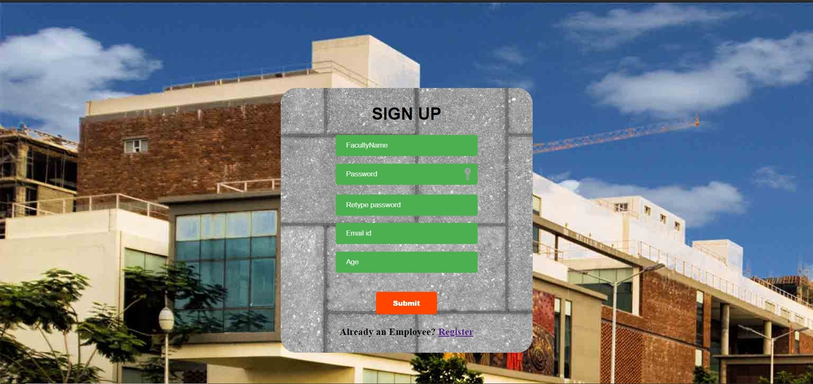
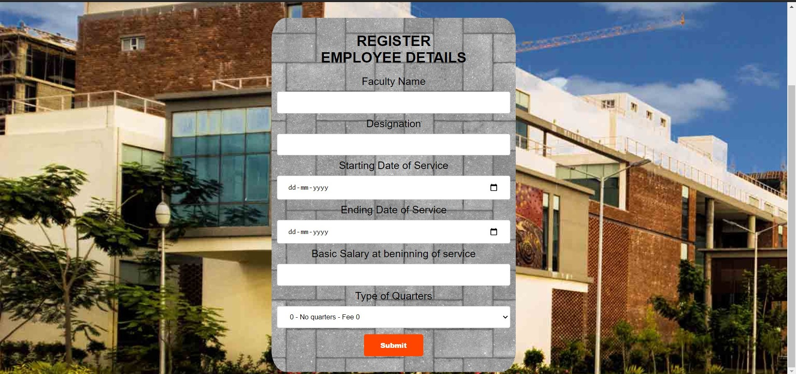
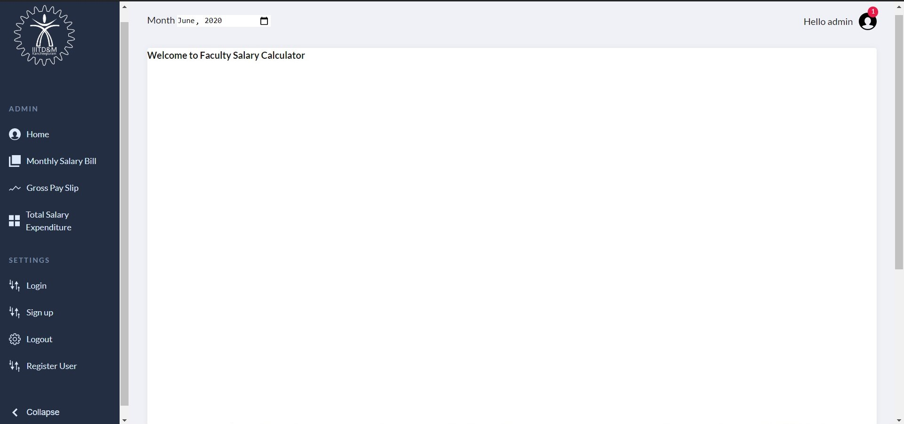
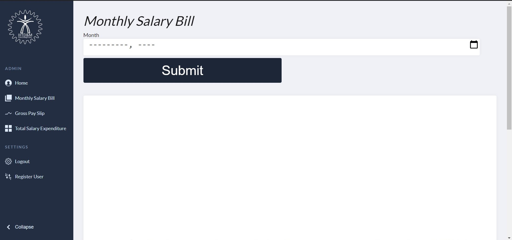
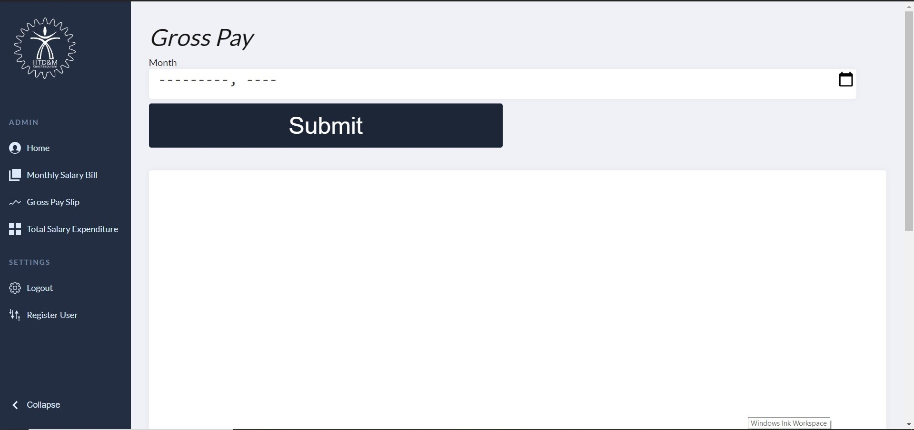
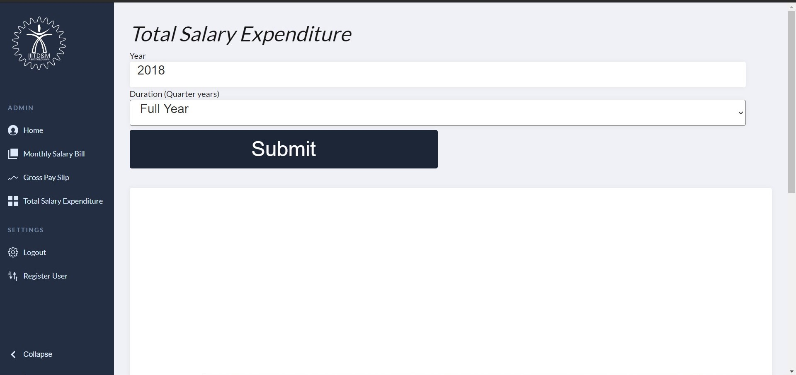

## Welcome to Faculty Salary Calculator ##
**Faculty Salary Calculator** is designed for employees of IIITDM Kancheepuram.
 

### Team Members ###
* Hrishikesh Rajesh Menon - COE18B024
* Thigulla Vamsi Krishna - COE18B056
* Srinivasan R Sharma - COE18B065
* Shashank Dokania - COE18B067
* Vijay Meena - CED18I057

### Features ###
* Generate salary bills of employees for a month
* Generate individual salary slips for employees for each month
* Account for increments, DA hikes, NoPay periods, etc
* Calculates TDS for the year
* Provides the total expenditure bill for each employee for the financial year
* With drill down facility, generates quarterly reports for the financial year
* Provides security through mandatory user registration and login

#### Sign Up ####

#### Register ####

#### Login ####

#### Homepage ####

#### Monthly Salary Bill ####

#### PaySlips ####

#### Total Expenditure Bill ####

